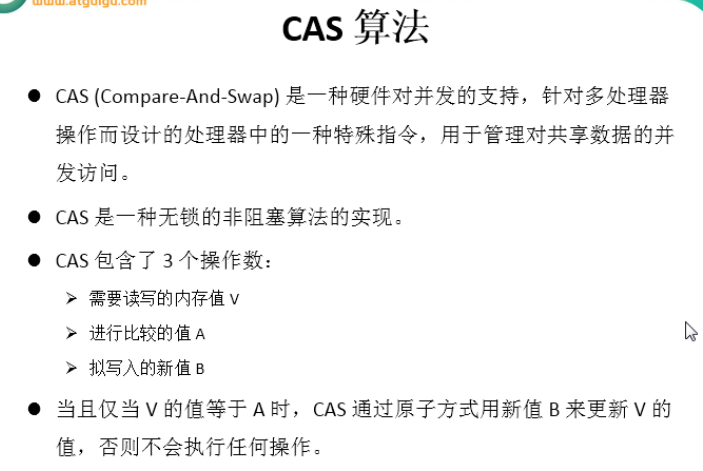
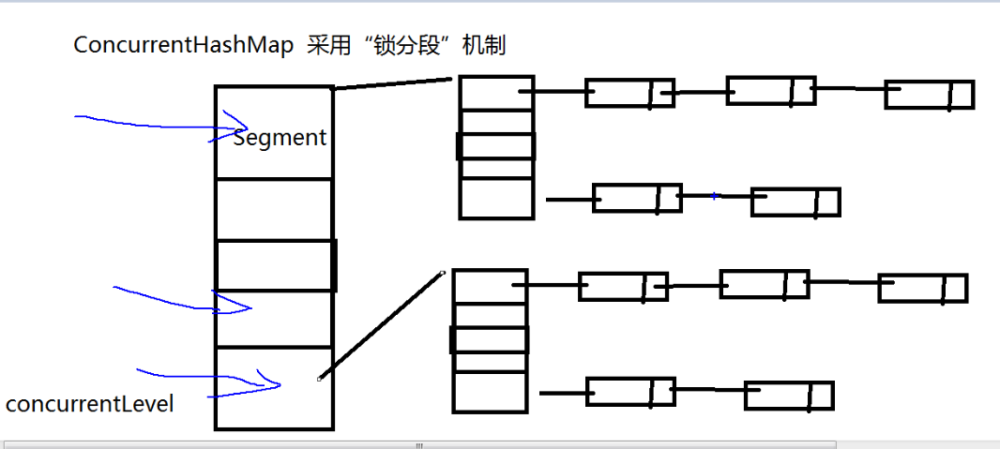
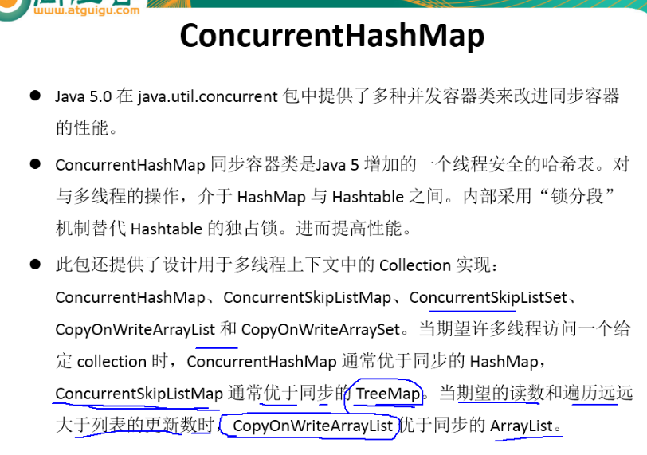
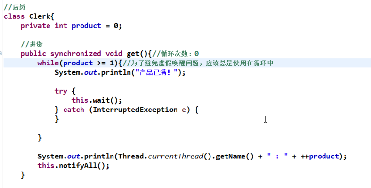

### 为什么使用多线程？

为了提高程序运行效率，但是需要注意使用不恰当反而起到相反效果，因为多线程消耗资源大，处理不好的话效率反而很低。

### 0，创建线程的方式有四种

还有一种是用线程池

### 1，CAS算法

### 2，ConcurrentHashMap相关

- HashMap有多线程安全问题，而HashTable虽然无线程安全问题，但速度较慢，因为多个线程访问HashTable对象时都会排队编程了单线程；

- 因此Java引入了ConcurrentHashMap类，用法和HashMap一样，只是线程安全了，同时也兼顾了访问速度；

- JDK1.8以前ConcurrentHashMap采用锁分段机制，

  默认情况下把数据分为16个段，每个段是一个链表()，一个段一把锁，这样就可以有16个线程同时访问了。提高了并发性能。

  JDK1.8以后底层改为采用了CAS算法；

### 3, CopyOnWriterArray<u>List/Set</u>	

这两个集合类是“写入并复制”，并发迭代操作多时可以使用这两个集合。但是添加操作多时，效率低，因为它们的原理是每次添加操作都会复制原集合。

### 4, 虚假唤醒

需要看教程（8，虚假唤醒），写完代码后总结

解决虚假唤醒，把if换成while ??

### 5, Thread Pool

[Official Tutorials Of Thread Pool in Java](https://docs.oracle.com/javase/tutorial/essential/concurrency/pools.html)

